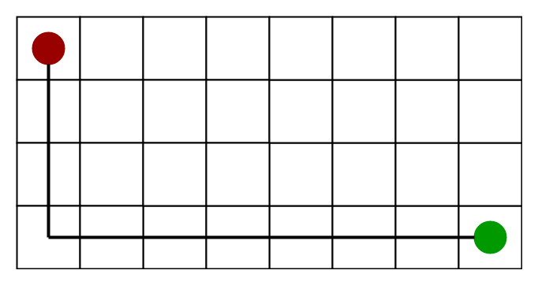

# A* Search

What A* Search Algorithm does is that at each step it picks the node according to a value-‘**f**’ which is a parameter equal to the sum of two other parameters – ‘**g**’ and ‘**h**’. At each step it picks the node/cell having the lowest ‘**f**’, and process that node/cell.

'g': the movement cost to move from the starting point to a given square on the grid, following the path generated to get there.

'h': heuristic function.  Estimate the movement cost from that given square on the grid the final destination.

## Algorithm

Two lists - Open List and Closed List

```
function reconstruct_path(cameFrom, current)
    total_path := {current}
    while current in cameFrom.Keys:
        current := cameFrom[current]
        total_path.prepend(current)
    return total_path

// A* finds a path from start to goal.
// h is the heuristic function. h(n) estimates the cost to reach goal from node n.
function A_Star(start, goal, h)
    // The set of discovered nodes that may need to be (re-)expanded.
    // Initially, only the start node is known.
    // This is usually implemented as a min-heap or priority queue rather than a hash-set.
    openSet := {start}

    // For node n, cameFrom[n] is the node immediately preceding it on the cheapest path from start
    // to n currently known.
    cameFrom := an empty map

    // For node n, gScore[n] is the cost of the cheapest path from start to n currently known.
    gScore := map with default value of Infinity
    gScore[start] := 0

    // For node n, fScore[n] := gScore[n] + h(n). fScore[n] represents our current best guess as to
    // how short a path from start to finish can be if it goes through n.
    fScore := map with default value of Infinity
    fScore[start] := h(start)

    while openSet is not empty
        // This operation can occur in O(1) time if openSet is a min-heap or a priority queue
        current := the node in openSet having the lowest fScore[] value
        if current = goal
            return reconstruct_path(cameFrom, current)

        openSet.Remove(current)
        for each neighbor of current
            // d(current,neighbor) is the weight of the edge from current to neighbor
            // tentative_gScore is the distance from start to the neighbor through current
            tentative_gScore := gScore[current] + d(current, neighbor)
            if tentative_gScore < gScore[neighbor]
                // This path to neighbor is better than any previous one. Record it!
                cameFrom[neighbor] := current
                gScore[neighbor] := tentative_gScore
                fScore[neighbor] := gScore[neighbor] + h(neighbor)
                if neighbor not in openSet
                    openSet.add(neighbor)

    // Open set is empty but goal was never reached
    return failure
		

```

## Heuristics

A) **Exact Heuristics** –

We can find exact values of h, but that is generally very time consuming.

Below are some of the methods to calculate the exact value of h.

1) Pre-compute the distance between each pair of cells before running the A* Search Algorithm.

2) If there are no blocked cells/obstacles then we can just find the exact value of h without any pre-computation using the [distance formula/Euclidean Distance](https://en.wikipedia.org/wiki/Euclidean_distance)

**B) Approximation Heuristics –** 

 There are generally three approximation heuristics to calculate h –

**1) Manhattan Distance –**

-  It is nothing but the sum of absolute values of differences in the  goal’s x and y coordinates  and the current cell’s x and y coordinates  respectively, i.e.,

  ```
   h = abs (current_cell.x – goal.x) + 
       abs (current_cell.y – goal.y) 
  ```

-  When to use this heuristic? – When we are allowed to move only in four directions only (right, left, top, bottom)

The Manhattan Distance Heuristics is shown by the below figure (assume red spot as source cell and green spot as target cell).
 

**2) Diagonal Distance-**

-  It is nothing but the maximum of absolute values of differences in  the goal’s x and y coordinates  and the current cell’s x and y  coordinates respectively, i.e.,

  ```
   h = max { abs(current_cell.x – goal.x),
             abs(current_cell.y – goal.y) } 
  ```

-  When to use this heuristic?  – When we are allowed to move in eight directions only (similar to a move of a King in Chess)

The Diagonal Distance Heuristics is shown by the below figure (assume red spot as source cell and green spot as target cell).


**3) Euclidean Distance-**

-  As it is clear from its name, it is nothing but the distance  between the current cell and the goal cell using the distance formula

  ```
   h = sqrt ( (current_cell.x – goal.x)2 + 
              (current_cell.y – goal.y)2 ) 
  ```

-  When to use this heuristic?  – When we are allowed to move in any directions. 

The Euclidean Distance Heuristics is shown by the below figure (assume red spot as source cell and green spot as target cell).

