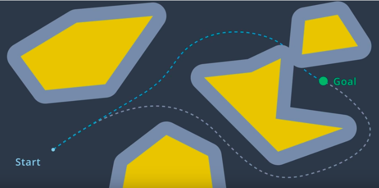
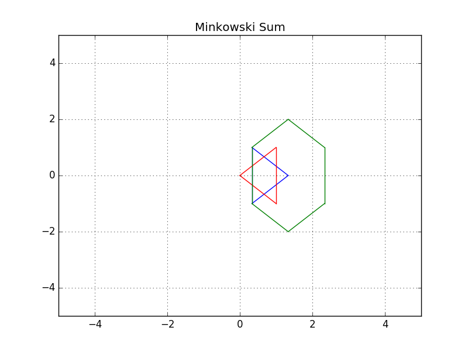

# Continuous Representation

## Configuration Space (C-space)

To account for the geometry of a robot and simplify the task of path planning, obstacles in the workspace can be inflated to create a new space called the the configuration space (C-space). With the obstacles inflated by the radius of the robot, the robot can then be treated as a point, making it easier for an algorithm to search for a path.  The C-space is the set of all robot poses, and can be broken-down into $$C_{Free}$$ and $$C_{Obs}$$.



## Minkowski Sum

The Minkowski sum is a mathematical property that can be used to compute the configuration space given an obstacle geometry and robot geometry.  The intuition behind the Minkowski sum is calculated can be understood by imagining to paint the outside of an obstacle using a paintbrush that is shaped like your robot, with the robot's **origin** as the **tip** of the paintbrush.  The painted area is $$C_{Obs}$$


To create the configuration space, the Minkowski sum is calculated in such a way for every obstacle in the workspace. The image below shows three configuration spaces created from a single workspace with three different sized robots. As you can see, if the robot is just a dot, then the obstacles in the workspace are only inflated by a small amount to create the C-space. As the size of the robot increases, the obstacles are inflated more and more.


## Minkowski Sum C++

In this example, you can see two triangles - a blue and a red one. Let's suppose the robot is represented by a blue triangle and the obstacle is represented by a red triangle. Your task is to compute the configuration space **C** of robot **A** and obstacle **B** in C++.

- **Robot**: Blue triangle denoted by A

- **Obstacle**: Red triangle denoted by B

  

```cpp
#include <iostream>
#include <vector>
#include <algorithm>

using namespace std;

// Print 2D vectors coordinate values
void print2DVector(vector<vector<int> > vec)
{
    // Sorting the vector for grading purpose
    sort(vec.begin(), vec.end());
    for (int i = 0; i < vec.size(); ++i) {
        for (int j = 0; j < vec[0].size(); ++j) {
                cout << vec[i][j] << "  ";
        }
        cout << endl;
    }
}

// Check for duplicate coordinates inside a 2D vector and delete them
vector<vector<int> > delete_duplicate(vector<vector<int> > C)
{
    // Sort the C vector
    sort(C.begin(), C.end());
    // Initialize a non duplicated vector
    vector<vector<int> > Cn;
    for (int i = 0; i < C.size() - 1; i++) {
        // Check if it's a duplicate coordinate
        if (C[i] != C[i + 1]) {
            Cn.push_back(C[i]);
        }
    }
    Cn.push_back(C[C.size() - 1]);
    return Cn;
}

// Compute the Minkowski Sum of two vectors
vector<vector<int> > minkowski_sum(vector<vector<int> > A, vector<vector<int> > B)
{
    vector<vector<int> > C;
    for (int i = 0; i < A.size(); i++) {
        for (int j = 0; j < B.size(); j++) {
            // Compute the current sum
            vector<int> Ci = { A[i][0] + B[j][0], A[i][1] + B[j][1] };
            // Push it to the C vector
            C.push_back(Ci);
        }
    }
    C = delete_duplicate(C);
    return C;
}

int main()
{
    // Define the coordinates of triangle A and B using 2D vectors
    vector<vector<int> > A(3, vector<int>(2));
    vector<vector<int> > B(3, vector<int>(2));

    // Compute the minkowski sum of triangle A and B
    vector<vector<int> > C;
    C = minkowski_sum(A, B);

    // Print the resulting vector
    print2DVector(C);

    return 0;
}
```

### Generated Configuration Space



### Translation

You successfully coded the Minkowski sum in C++ and generated the configuration space. You can easily notice that the red obstacle is not well inflated and the blue robot can still hit the obstacle. That's because the configuration space still has to be shifted to the obstacle.

Initially, the robot should be translated to the obstacle, and then after computing the configuration space, it should be translated to both the robot and obstacle.

### Final Result


## 3D Configuration Space

As you saw, the configuration space for a robot changes depending on its rotation. Allowing a robot to rotate adds a degree of freedom - so, sensibly, it complicates the configuration space as well. Luckily, this is actually very simple to handle. The dimension of the configuration space is equal to the number of degrees of freedom that the robot has.

While a 2D configuration space was able to represent the x- and y-translation of the robot, a third dimension is required to represent the rotation of the robot.

Let’s look at a robot and its corresponding configuration space for two different rotations. The first will have the robot at 0°, and the second at 18°.


A three-dimensional configuration space can be generated by stacking two-dimensional configuration spaces as layers - as seen in the image below.


If we were to calculate the configuration spaces for infinitesimally small rotations of the robot, and stack them on top of each other - we would get something that looks like the image below.

