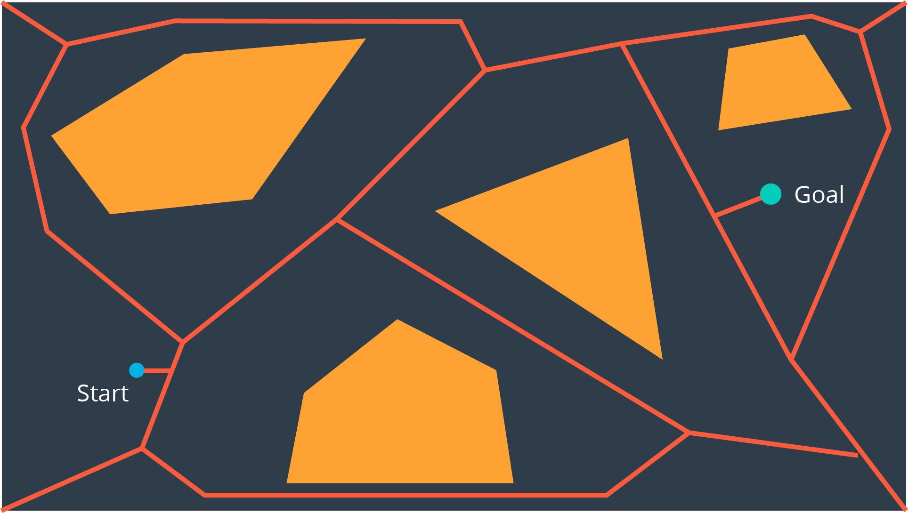

# Voronoi Diagram

Unlike the visibility graph method which generates the shortest paths, Voronoi Diagrams **maximize clearance between obstacles**.

A Voronoi Diagram is a graph whose edges bisect the free space in between obstacles.  Every edge lies equidistant from each obstacle around it - with the greatest amount of clearance possible.

Once a Voronoi Diagram is constructed for a workspace, it can be used for multiple queries.  Start and goal nodes can be connected into the graph by constructing the paths from the nodes to the edge closest to each of them.

Every edge will either be a straight line, if it lies between the edges of two obstacles, or it will be a quadratic, if it passes by the vertex of an obstacle.

