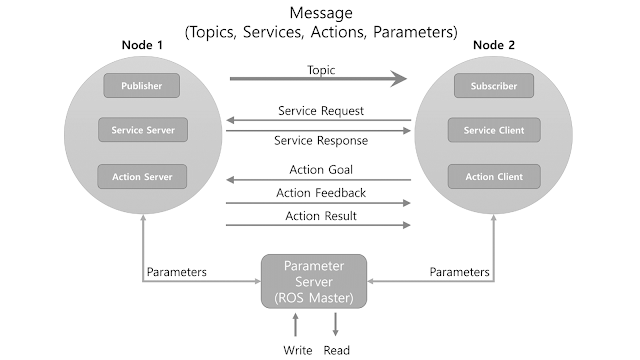

# ROS Essentials

## ROS Summary

1. Open source
2. Hardware abstraction of device drivers
3. Communication via message passing
4. Slick build and package management
5. Tools for visualization, simulation, analysis
6. Powerful software libraries

## Nodes and Topics

3 high level steps:

1. Perception
2. Decision Making
3. Actuation

ROS breaks down the three major steps into separate nodes, for example:

## Parameter server (Master)

Acts as a central repository where nodes on a system can look up parameter values.

## Topics

Nodes pass messages to one another via **topics**, which you can think of as a pipe connecting two nodes. Nodes can share data with one another by passing **messages** over **topics**.

To send a message, a node publish to that topic.

To receive a message, a node subscribes to a topic.

## Message Passing

Over pre-defined 200 message types + user-defined types

For example:

Physical Quantities: positions, velocities, rotations.

Sensor Readings: laser scan, images, point clouds

## Services

**Request-Response** type
Like topics, services allow the passing of messages between nodes.  However, services have **no publishers or subscribers**. Instead, nodes interact with each other one-by-one by using request and response messages.

## Compute Graph

An RQT graph

## ROS Terminology

| Type    | Features     | Direction      | Description                                                  |
| ------- | ------------ | -------------- | ------------------------------------------------------------ |
| Topic   | Asynchronous | Unidirectional | Used when exchanging data continuously                       |
| Service | Synchronous  | Bi-directional | Used when request processing requests and responds current states |
| Action  | Asynchronous | Bi-directional | Used when it is difficult to use the service due to long response times after the request or when an intermediate feedback value is needed. |

**ROS**
 ROS provides standard operating system services such as hardware  abstraction, device drivers,implementation of commonly used features  including sensing, recognizing, mapping, motion planning, message  passing between processes, package management, visualizers and libraries for development as well as debugging tools.

**Master**
 The master 2 acts as a name server for node-to-node connections and  message communication. The command roscore is used to run the master,  and if you run the master, you can register the name of each node and  get information when needed. The connection between nodes and message  communication such as topics and services are impossible without the  master.

**Node**
 A node 4 refers to the smallest unit of processor running in ROS. Think  of it as one executable program. ROS recommends creating one single node for each purpose, and it is recommended to develop for easy  reusability. For example, in case of mobile robots, the program to  operate the robot is broken down into specialized functions. Specialized node is used for each function such as sensor drive, sensor data  conversion, obstacle recognition, motor drive, encoder input, and navigation**.**

**Package**
 A package 6 is the basic unit of ROS. The ROS application is developed  on a package basis, and the package contains either a configuration file to launch other packages or nodes. 
**
****Metapackage**
 A metapackage 7 is a set of packages that have a common purpose. For  example, the Navigation metapackage consists of 10 packages including  AMCL, DWA, EKF, and map_server.

**Message**
 A node 8 sends or receives data between nodes via a message. Messages  are variables such as integer, floating point, and boolean. Nested  message structure that contains another messages or an array of messages can be used in the message.

**Topic**
 The topic 9 is literally like a topic in a conversation. The publisher  node first registers its topic with the master and then starts  publishing messages on a topic. Subscriber nodes that want to receive  the topic request information of the publisher node corresponding to the name of the topic registered in the master.

**Publish and Publisher**
 The term ‘publish’ stands for the action of transmitting  relative messages corresponding to the topic. The publisher node  registers its own information and topic with the master, and sends a  message to connected subscriber nodes that are interested in the same  topic. The publisher is declared in the node and can be declared  multiple times in one node.

**Subscribe and Subscriber**
 The term ‘subscribe’ stands for the action of receiving relative messages corresponding to the topic. The subscriber node registers its  own information and topic with the master, and receives publisher  information that publishes relative topic from the master. Based on  received publisher information, the subscriber node directly requests  connection to the publisher node and receives messages from the  connected publisher node. A subscriber is declared in the node and can  be declared multiple times in one node

**Service**
 The service 10 is synchronous bidirectional communication  between the service client that requests a service regarding a  particular task and the service server that is responsible for  responding to requests.

**Service Server**
 The ‘service server’ is a server in the service message  communication that receives a request as an input and transmits a  response as an output. Both request and response are in the form of  messages. Upon the service request, the server performs the designated  service and delivers the result to the service client as a response. The service server is implemented in the node that receives and executes a  given request.

**Service Client**
 The ‘service client’ is a client in the service message  communication that requests service to the server and receives a  response as an input. Both request and response are in the form of  message. The client sends a request to the service server and receives  the response. The service client is implemented in the node which  requests specified command and receives results.

**Action**
 The action 11 is another message communication method used for  an asynchronous bidirectional communication. Action is used where it  takes longer time to respond after receiving a request and intermediate  responses are required until the result is returned. The structure of  action file is also similar to that of service. However, feedback data  section for intermediate response is added along with goal and result  data section which are represented as request and response in service  respectively. There are action client that sets the goal of the action  and action server that performs the action specified by the goal and  returns feedback and result to the action client.

**Action Server**
 The ‘action server’ is in charge of receiving goal from the client and  responding with feedback and result. Once the server receives goal from  the client, it performs predefined process.

**Action Client**
 The ‘action client’ is in charge of transmitting the goal to the server and receives result or feedback data as inputs from the action  server. The client delivers the goal to the action server, then receives corresponding result or feedback, and transmits follow up instructions  or cancel instruction.

**Parameter**
 The parameter 12 in ROS refers to parameters used in the node.  Think of it as *.ini configuration files in Windows program. Default  values are set in the parameter and can be read or written if necessary. In particular, it is very useful when configured values can be modified in real-time. For example, you can specify settings such as USB port  number, camera calibration parameters, maximum and minimum values of the motor speed.

**Parameter Server**
 When parameters are called in the package, they are registered with the parameter server which is loaded in the master.

**Catkin**
 The catkin 14 refers to the build system of ROS. The build  system basically uses CMake (Cross Platform Make), and the build  environment is described in the ‘CMakeLists.txt’ file in the
 package folder. CMake was modified in ROS to create a ROS-specific
 build system.

**ROS Build**
 The ROS build (rosbuild) 15 is the build system that was used  before the Catkin build system. Although there are some users who still  use it, this is reserved for compatibility of ROS, therefore, it is  officially not recommended to use. If an old package that only supports  the rosbuild must be used, we recommend using it after converting  rosbuild to catkin.

**roscore** 
 roscore 16 is the command that runs the ROS master. If multiple  computers are within the same network, it can be run from another  computer in the network. However, except for special case that supports  multiple roscore, only one roscore should be running in the network.  When ROS master is running, the URI address and port number assigned for ROS_MASTER_URI environment variables are used. If the user has not set  the environment variable, the current local IP address is used as the  URI address and port number 11311 is used which is a default port number for the master.

**rosrun**
 rosrun 17 is the basic execution command of ROS. It is used to run a  single node in the package. The node uses the ROS_HOSTNAME environment  variable stored in the computer on which the node is running as the URI  address, and the port is set to an arbitrary unique value.

**roslaunch**
 While rosrun is a command to execute a single node, roslaunch 18 in
 contrast executes multiple nodes. It is a ROS command specialized in  node execution with additional functions such as changing package  parameters or node names, configuring namespace of nodes, setting  ROS_ROOT and ROS_PACKAGE_PATH, and changing environment variables 19  when executing nodes. roslaunch uses the ‘*.launch’ file to define which nodes to be executed. The file is based on XML (Extensible Markup  Language) and offers a variety of options in the form of XML tags.

**bag**
 The data from the ROS messages can be recorded. The file format  used is called bag 20 , and ‘*.bag’ is used as the file extension. In  ROS, bag can be used to record messages and play them back when  necessary to reproduce the environment when messages are recorded. For  example, when performing a robot experiment using a sensor, sensor  values are stored in the message form using the bag. This recorded  message can be repeatedly loaded without performing the same test by  playing the saved bag file. Record and play functions of rosbag are  especially useful when developing an algorithm with frequent program  modifications.

**ROS Wiki**
 ROS Wiki is a basic description of ROS based on Wiki  (http://wiki.ros.org/) that explains each package and the features  provided by ROS. This Wiki page describes the basic usage of ROS, a  brief description of each package, parameters used, author, license,  homepage, repository, and tutorial. The ROS Wiki currently has more than 18,800 pages of content.

**Repository**
An open package specifies repository in the Wiki page. The  repository is a URL address on the web where the package is saved. The  repository manages issues, development, downloads, and other features  using version control systems such as svn, hg, and git. Many of  currently available ROS packages are using GitHub 21 as repositories for source code. In order to view the contents of the source code for each  package, check the corresponding repository.

**Graph**
 The relationship between nodes, topics, publishers, and  subscribers introduced above can be visualized as a graph. The graphical representation of message communication does not include the service as it only happens one time. The graph can be displayed by running the  ‘rqt_graph’ node in the ‘rqt_graph’ package. There are two execution  commands, ‘rqt_graph’ and ‘rosrun rqt_graph rqt_graph’.

**Name**
 Nodes, parameters, topics, and services all have names 22 .  These names are registered on the master and searched by the name to  transfer messages when using the parameters, topics, and services of  each node. Names are flexible because they can be changed when being  executed, and different names can be assigned when executing identical  nodes, parameters, topics, and services multiple times. Use of names  makes ROS suitable for large-scale projects and complex systems.

**Client Library**

 ROS provides development environments for various languages by  using client library 23 in order to reduce the dependency on the  language used. The main client libraries are C++, Python, Lisp,and other languages such as Java, Lua, .NET, EusLisp, and R are also supported.  For this purpose, client libraries such as roscpp, rospy, roslisp,  rosjava, roslua, roscs, roseus, PhaROS, and rosR
 have been developed.

**URI**
 A URI (Uniform Resource Identifier) is a unique address that represents a resource on the Internet. The URI is one of basic components that  enables interaction with Internet and is used as an identifier in the  Internet protocol

**MD5**
 MD5 (Message-Digest algorithm 5) 24 is a 128-bit cryptographic hash  function. It is used primarily to verify data integrity, such as  checking whether programs or files are in its unmodified original form.  The integrity of the message transmission/reception in ROS is verified  with MD5.

**RPC**
 RPC (Remote Procedure Call) 25 stands for the function that  calls a sub procedure on a remote computer from another computer in the  network. RPC uses protocols such as TCP/IP and IPX, and allows execution of functions or procedures without having the developer to write a  program for remote control

**XML**
 XML (Extensible Markup Language) is a broad and versatile markup language that W3C recommends for creating other special purpose markup  languages. XML utilizes tags in order to describe the structure of data. In ROS, it is used in various components such as *.launch, *.urdf, and  package.xml.

**XMLRPC**
 XMLRPC (XML-Remote Procedure Call) is a type of RPC protocol that uses  XML as the encoding format and uses the request and response method of  the HTTP protocol which does not maintain nor check the connection.  XMLRPC is a very simple protocol, used only to define small data types  or commands. As a result, XMLRPC is very lightweight and supports a  variety of programming languages, making it well suited for ROS, which  supports a variety of hardware and languages.

**TCP/IP**
 TCP stands for Transmission Control Protocol. It is often called  TCP/IP. The Internet protocol layer guarantees data transmission using  TCP, which is based on the IP (Internet Protocol) layer in the Internet  Protocol Layers. It guarantees the sequential transmission and reception of data.TCPROS is a message format based on TCP/IP and UDPROS is a  message format based on UDP. TCPROS is more frequently used in ROS.

**CMakeLists.txt** 
 Catkin, which is the build system of ROS, uses CMake by default. The  build environment is specified in the ‘CMakeLists.txt’ 26 file in each  package folder.

**package.xml**
 An XML file 27 contains package information that describes the package name, author, license, and dependent packages. 