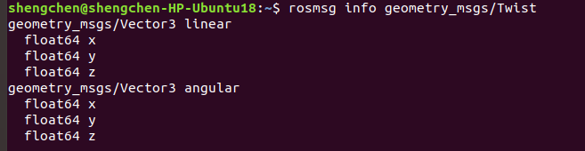

# TurtleSim

## Source the ROS environment

Add the command into  `~/.bashrc file`. 

```bash
source /opt/ros/melodic/setup.bash
```

## Run TurtleSim

### Start the Master Process

Before you can run any ROS nodes, you must start the Master process.

The Master process is responsible for the following (and more):

- Providing naming and registration services to other running nodes
- Tracking all publishers and subscribers
- Aggregating log messages generated by the nodes
- Facilitating connections between nodes

To run the master process, execute the command

```bash
roscore
```

### Run Turtlesim Nodes

First we will start the `turtlesim_node`, in the `turtlesim` package using the following command in a second terminal instance.

```sh
$ rosrun turtlesim turtlesim_node
```

Next, we will start the `turtle_teleop_key node`, also from the `turtlesim` package in a third terminal instance.

```sh
$ rosrun turtlesim turtle_teleop_key
```

By using the arrow keys with the `turtle_teleop_key` node’s console selected, we are able to move the turtle in turtlesim!

### List All Active Nodes

```bash
rosnode list
```

We can see that there are three active nodes that have been registered with the ROS Master: `/rosout`, `/teleop_turtle`, and `/turtlesim`.

- `/rosout`: This node is launched by roscore. It subscribes to the standard /rosout topic, the topic to which all nodes send log messages.
- `/teleop_turtle`: This is our keyboard teleop node. Notice that its not named turtle_teleop_key. There’s no requirement that a node’s broadcasted name is the same as the name of it’s associated executable.
- `/turtlesim`: The node name associated with the turtlebot_sim node.

### Listing All Topics

```bash
rostopic list
```

- `/rosout_agg`: Aggregated feed of messages published to /rosout.
- `/turtle1/cmd_vel`: Topic on which velocity commands are sent/received. Publishing a velocity message to this topic will command turtle1 to move.
- `/turtle1/color_sensor`: Each turtle in turtlesim is equipped with a color sensor, and readings from the sensor are published to this topic.
- `/turtle1/pose`: The position and orientation of turtle1 are published to this topic.

### Get Information About a Specific Topic

We wish to get information about a specific topic, who is publishing to it, subscribed to it, or the type of message associated with it, we can use the command `rostopic info` . Let’s check into the `/turtle1/cmd_vel` topic:

#### Message Information

Let’s get some more information about the `geometry_msgs/Twist` message on the `/turtle1/cmd_vel` topic, to do so, we will use the `rosmsg info` info command.

```bash
rosmsg info geometry_msgs/Twist
```



We can see that a `Twist` message consists nothing more than two `Vector3` messages. One for linear velocity, and another for angular velocity, with each velocity component (x,y,z) represented by a float64.

### Echo Messages on a Topic

Sometimes it may be useful to look at a topic’s published messages in real time. To do so, we can use the command `rostopic echo`. Let’s take a look at the `/turtle1/cmd_vel` topic.

```bash
$ rostopic echo /turtle1/cmd_vel
```

If we then command the turtle to move from the `turtle_teleop_key` window, we will be able to see the output message in real-time!

