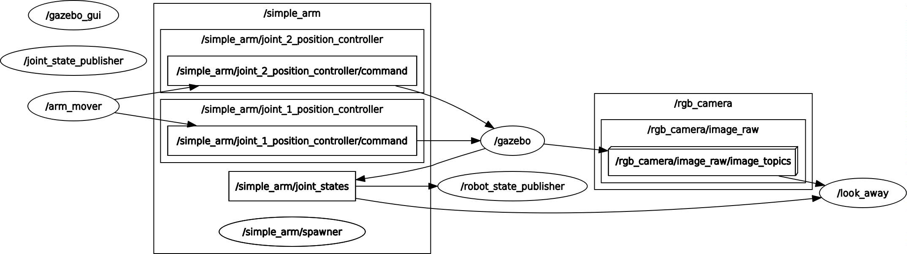

# Write ROS Nodes

## What this program does

Whenever the camera is pointed towards an uninteresting image - in this case, an image with uniform color - the callback function will request a `safe_move` service to safely move the arm to something more interesting. 

## Graph

